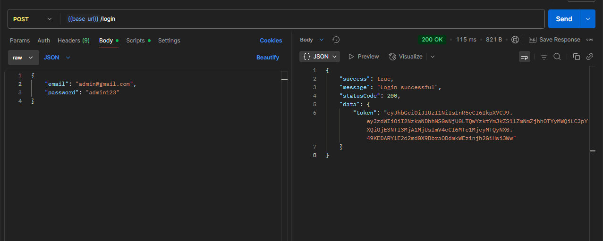
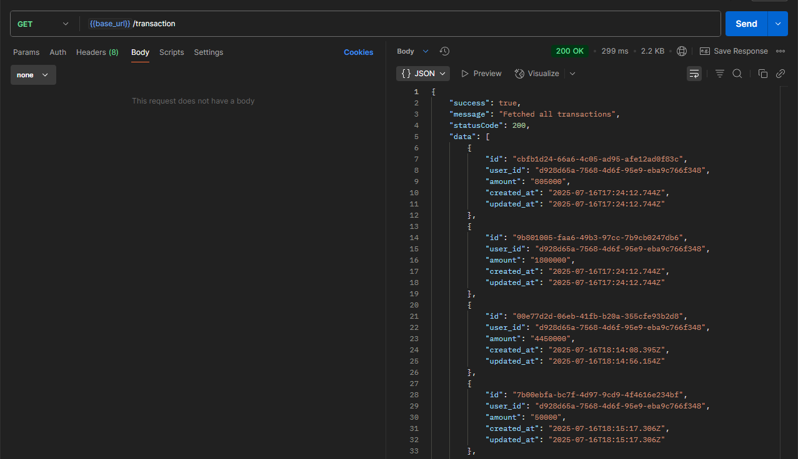
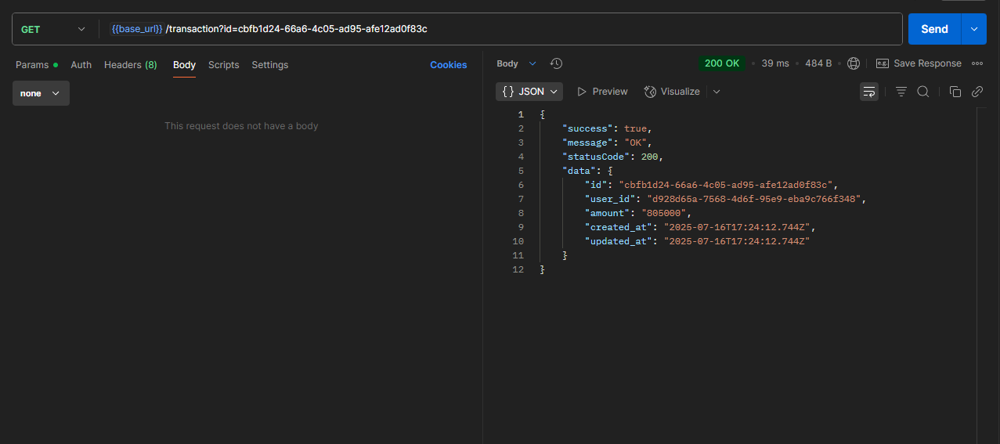
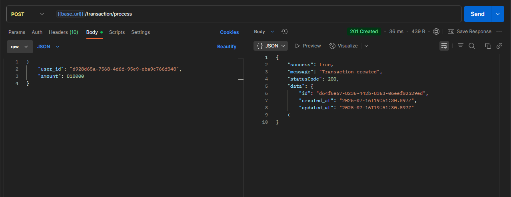
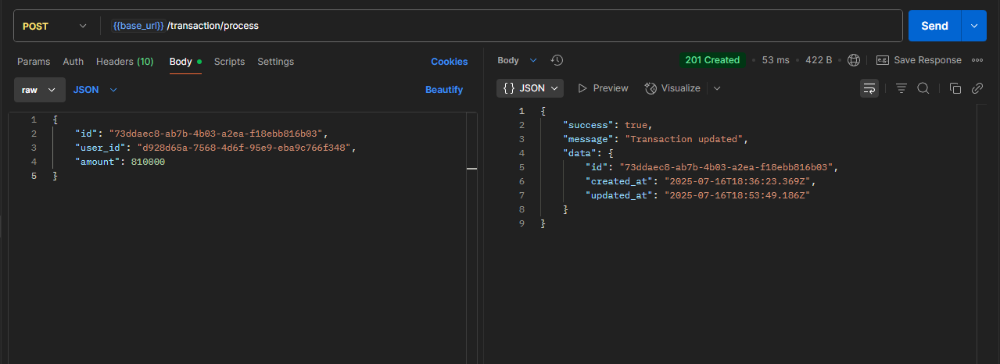
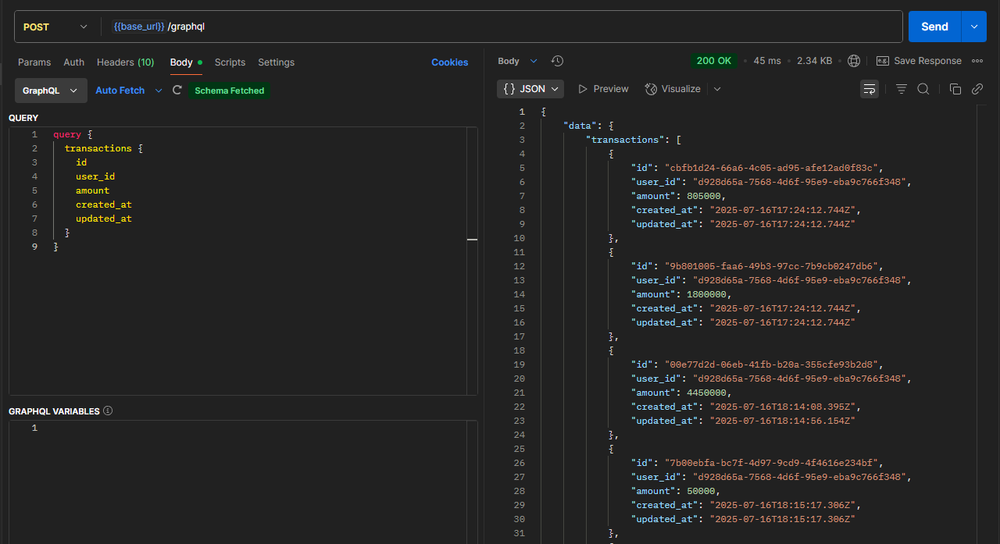
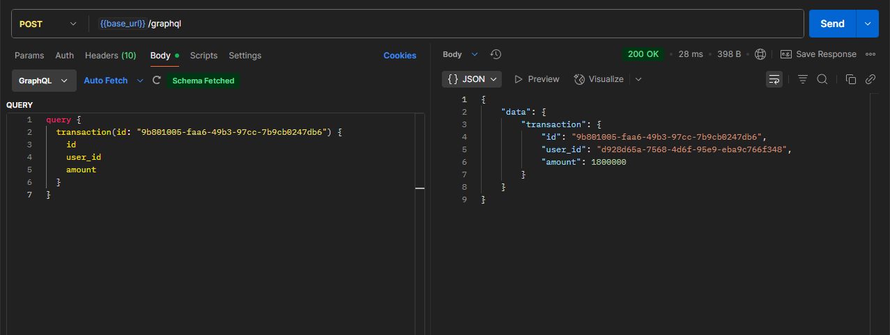
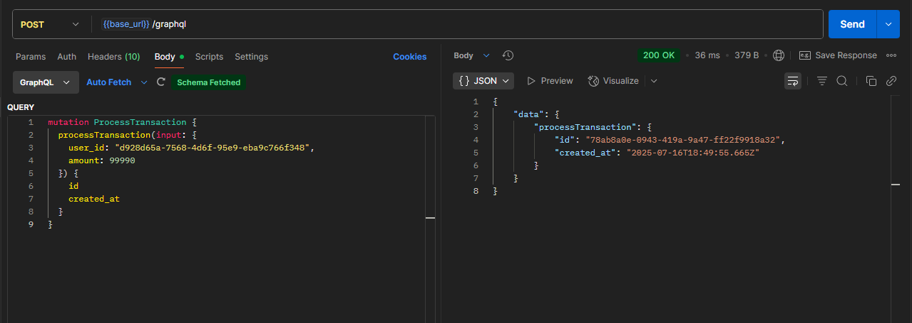
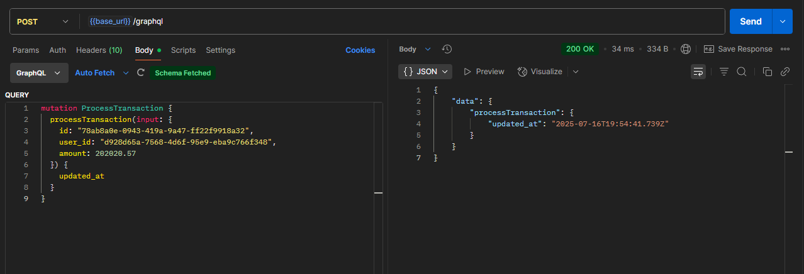

#  NestJS API – Login & Register (REST), Transaction (REST & GraphQL)

This is a simple backend API built with **NestJS** that supports both REST and GraphQL.

[🌐 Live Demo](https://api-demo11.icatchu.id)

## 🔧 Features

- 🛡️ **Login via REST** (`/login`) with secure JWT authentication
- 📋 **Fetch transaction data** using GraphQL
- 📡 GraphQL endpoint at `/graphql`

## 🚀 Tech Stack

| Category        | Tools / Libraries               |
| --------------- | ------------------------------- |
| Framework       | [NestJS](https://nestjs.com/)   |
| Language        | TypeScript                      |
| Authentication  | JWT, Passport                   |
| GraphQL Support | Apollo Server + @nestjs/graphql |
| Database        | PostgreSQL                      |
| Hashing         | bcrypt / bcryptjs               |

## 🛠️ Deployment & OPS Stack

This project uses the following stack for deployment and infrastructure:

- **VPS** – Hosts the application
- **Docker** – Builds and runs the application in isolated environments
- **Nginx** – Serves as a reverse proxy and handles routing
- **GitHub Actions** – CI/CD pipeline for build and deployment automation
- **Cloudflare** – Provides DNS management, firewall, and DDoS protection

## 📂 Project Structure

```
.
├── data-source.ts                  # Database connection configuration (TypeORM)
├── src
│  ├── app                          # Root module and app-level setup
│  ├── auth                         # Authentication module
│  │  ├── auth.controller.ts        # REST endpoints for login/register/logout
│  │  ├── auth.service.ts           # Auth logic (JWT, hashing, etc)
│  │  └── guards
│  │     ├── jwt-auth.guard.ts      # JWT Auth Guard for REST
│  │     └── gql-auth.guard.ts      # JWT Auth Guard for GraphQL
│  ├── common                       # Common DTOs, filters, etc.
│  ├── graphql                      # GraphQL configuration (Resolvers, Schema bindings)
│  ├── migrations                   # TypeORM database migrations
│  ├── transaction                  # Transaction feature module (REST + GraphQL)
│  │  ├── transaction.controller.ts
│  │  ├── transaction.resolver.ts
│  │  ├── transaction.service.ts
│  │  └── dto/...
│  ├── main.ts                      # Application bootstrap file
```

## 🔁 REST API

Login endpoint:

**POST** `/login`

#### 🧾 Request Body

```json
{
  "email": "admin@gmail.com",
  "password": "admin123"
}
```

- Returns JWT token & refresh token in cookies
- Use token in Authorization header for protected routes & GraphQL



---

Register endpoint:

**POST** `/register`

#### 🧾 Request Body

```json
{
  "name": "Admin One",
  "email": "admin@gmail.com",
  "password": "admin123"
}
```


---

Get All transaction endpoint:

**GET** `/transaction`



---

Get One transaction endpoint:

**GET** `/transaction?id=UUID`



---

Insert endpoint:

**POST** `/transaction/process`

#### 🧾 Request Body

```json
{
    "user_id": "d928d65a-7568-4d6f-95e9-eba9c766f348",
    "amount": 810000
}
```



---

Update endpoint:

**POST** `/transaction/process`

#### 🧾 Request Body

```json
{
    "id": "73ddaec8-ab7b-4b03-a2ea-f18ebb816b03",
    "user_id": "d928d65a-7568-4d6f-95e9-eba9c766f348",
    "amount": 704050
}

```



## 🧵 GraphQL Access

GraphQL endpoint:  
**POST** `/graphql`

### 📡 Example Queries

### - Get All transaction data

```graphql
query {
  transactions {
    id
    user_id
    amount
    created_at
    updated_at
  }
}
```



### - Get One transaction data

```graphql
query {
  transaction(id: "9b801005-faa6-49b3-97cc-7b9cb0247db6") {
    id
    user_id
    amount
  }
}
```



### - Insert transaction data

```graphql
mutation ProcessTransaction {
  processTransaction(
    input: { user_id: "d928d65a-7568-4d6f-95e9-eba9c766f348", amount: 99990 }
  ) {
    id
    created_at
  }
}
```



### - Update transaction data

```graphql
mutation ProcessTransaction {
  processTransaction(
    input: {
      id: "78ab8a0e-0943-419a-9a47-ff22f9918a32"
      user_id: "d928d65a-7568-4d6f-95e9-eba9c766f348"
      amount: 2025.17
    }
  ) {
    updated_at
  }
}
```



## 🧰 System Requirements

Before running this project, ensure your system meets the following requirements:

- **Node.js**: >= 18.x
- **npm**: >= 9.x (comes with Node.js)
- **PostgreSQL**: >= 13.x

> Make sure PostgreSQL is up and running, and the credentials in `.env` match your setup.

## 🛠️ Installation Instructions

Follow these steps to set up and run the project:

### 1. Clone the Repository
```bash
git clone https://github.com/joshua-ather/api-demo-11.git
cd api-demo-11
```

### 2. Install Dependencies
```bash
npm install
```

### 3. Copy Environment File
Create a .env file from the example:
```bash
cp .env.example .env
```

### 4. Create the Database (Manual Step)
Before running migrations, make sure the database has already been created based on the DATABASE_NAME value in your .env.

Using PostgreSQL CLI:
```bash
psql -U postgres
CREATE DATABASE your_db_name;
```
Replace _your_db_name_ with your desired database name.

### 5. Run Database Migrations
```bash
npm run migration:run
```

### 6. Start the Development Server
```bash
npm run start:dev
```

## 📬 Postman Collection
> [📁 Click here to download](https://github.com/joshua-ather/api-demo-11/releases/download/assets/demo11.postman_collection.json)

## ✍️ Author

Made with ❤️ by Jo  
[LinkedIn](https://www.linkedin.com/in/joshua-ather)
